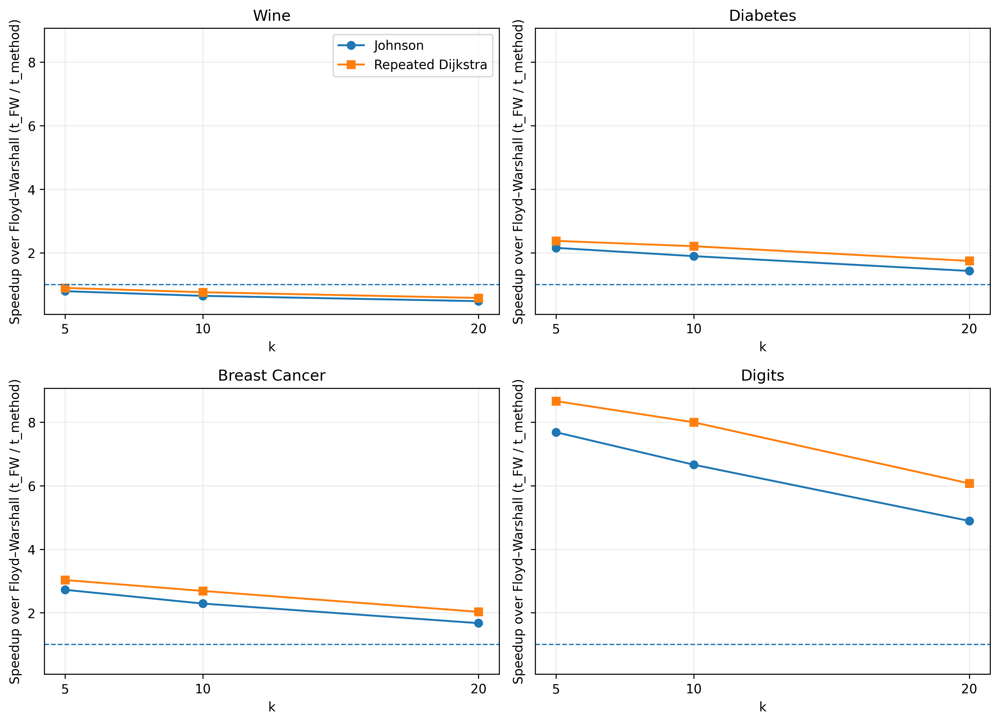
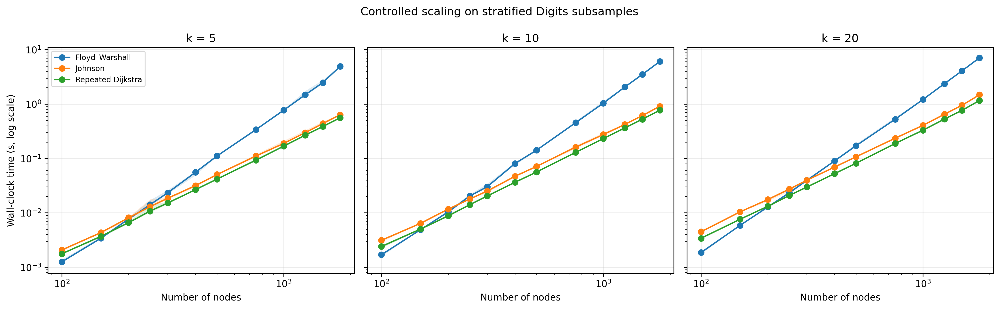
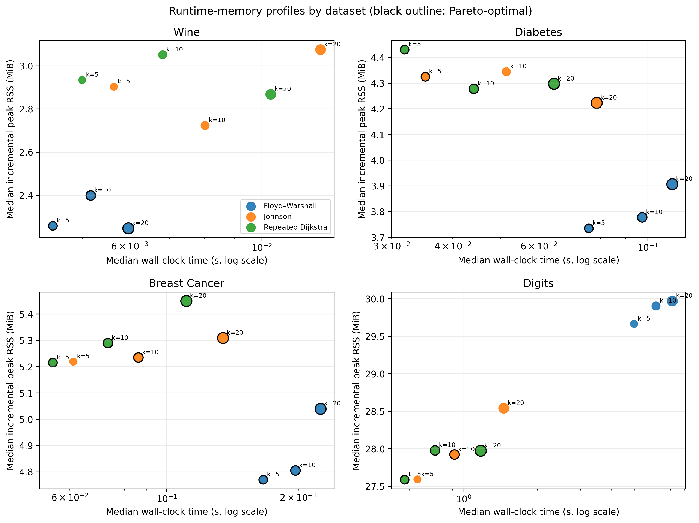
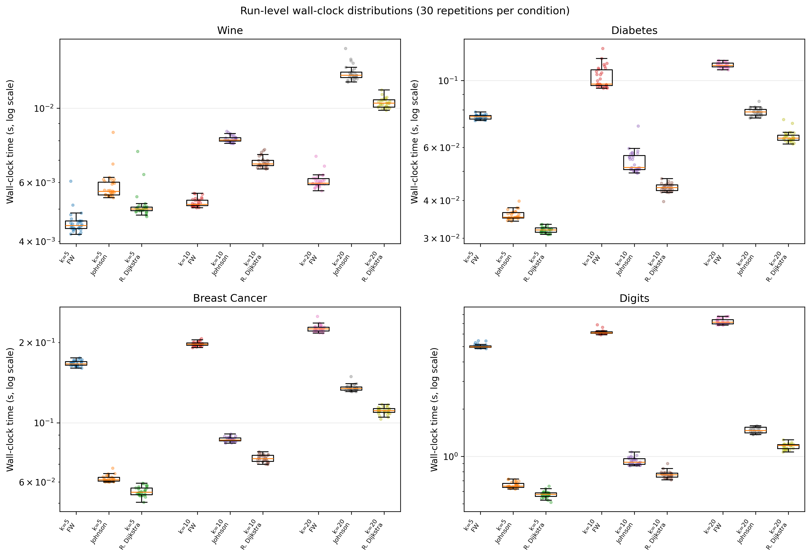

<div align="center">

# 🚀 APSP-kNN Benchmark

### Reproducible Runtime, Memory, Scaling, and Numerical-Equivalence Benchmarking on kNN Graphs

**Companion repository for the manuscript**  
### *Comparative Benchmarking of All-Pairs Shortest-Path Algorithms on k-Nearest Neighbor Graphs*

[](#-publication-status--citation)

[](https://www.python.org/)
[](https://scipy.org/)
[](https://scikit-learn.org/)
[](https://networkx.org/)
[](https://colab.research.google.com/)
[](#-reproducibility-and-validation)
[](#-numerical-equivalence)

**Floyd-Warshall · Johnson · Repeated Dijkstra · kNN Graphs · Benchmarking · Reproducibility**

[📖 Overview](#-overview) · [📊 Results](#-key-results) · [▶️ Colab](#️-run-in-google-colab) · [🧪 Reproduce](#-reproduce-the-study) · [📁 Structure](#-repository-structure) · [📝 Publication & Citation](#-publication-status--citation)

</div>

---

## 🎯 Overview

This repository contains the **reproduction code, benchmark outputs, graph files, figures, and Google Colab notebooks** for an implementation-level comparison of three all-pairs shortest-path (APSP) methods available through SciPy:

- **Floyd-Warshall** (`FW`)
- **Johnson** (`J`)
- **Repeated Dijkstra** (`D`)

The methods are evaluated on **positive-weight, undirected k-nearest-neighbor (kNN) graphs** constructed from four public datasets. The study focuses on practical implementation behavior rather than abstract algorithmic complexity alone.

> [!IMPORTANT]
> The reported rankings apply to the tested **SciPy execution paths**, graph construction protocol, software stack, and execution environment. They should not be interpreted as universal rankings for every implementation of Floyd-Warshall, Johnson, or Dijkstra.

> [!NOTE]
> **Publication status:** The manuscript *Comparative Benchmarking of All-Pairs Shortest-Path Algorithms on k-Nearest Neighbor Graphs* has **not yet been published**. Journal name, volume/issue, page range, DOI, and the final article citation will be added to this repository after publication. Until then, users who rely on the code, data, or benchmark outputs may cite this GitHub repository as the reproducibility resource.

---

## ✨ What this repository provides

| Component | Included |
|---|:---:|
| Reproduction-ready Google Colab notebooks | ✅ |
| Four public datasets used in the study | ✅ |
| Twelve original kNN graphs | ✅ |
| Controlled Digits scaling graphs | ✅ |
| Raw runtime measurements | ✅ |
| Fresh-process memory measurements | ✅ |
| Numerical-equivalence checks | ✅ |
| Manuscript figures | ✅ |
| Claim-verification script | ✅ |
| Environment metadata | ✅ |

---

## 🧠 Research question

The study asks a practical question:

> **When the same weighted kNN graph and the same complete APSP distance-matrix output are required, how do the SciPy implementations of Floyd-Warshall, Johnson, and repeated Dijkstra differ in runtime, process-level memory use, and scaling behavior?**

The benchmark therefore keeps the mathematical task fixed and compares the observed behavior of the corresponding SciPy execution paths.

---

## 📚 Datasets

| Dataset | Samples | Features | Task type |
|---|---:|---:|---|
| Wine | 178 | 13 | Classification |
| Diabetes | 442 | 10 | Regression |
| Breast Cancer Wisconsin Diagnostic | 569 | 30 | Classification |
| Digits | 1,797 | 64 | Classification |

Targets are **not used** in graph construction or APSP benchmarking.

### Graph construction

For each dataset:

1. Features are standardized to **zero mean and unit variance**.
2. Euclidean distance is used for neighbor search and edge weighting.
3. kNN graphs are constructed for `k = 5, 10, 20`.
4. Directed neighborhoods are converted to an undirected **union graph**.
5. Self-edges are removed and duplicate undirected edges are stored once.
6. Connectivity is verified before APSP benchmarking.

All 12 original graphs form a single connected component.

---

## 🧪 Benchmark design

```text
Public datasets
     │
     ▼
Feature standardization
     │
     ▼
kNN graph construction
(k = 5, 10, 20)
     │
     ├───────────────┬──────────────────┐
     ▼               ▼                  ▼
Floyd-Warshall     Johnson      Repeated Dijkstra
     │               │                  │
     └───────────────┴──────────────────┘
                     │
                     ▼
        Same dense float64 V × V output
                     │
       ┌─────────────┼─────────────┐
       ▼             ▼             ▼
    Runtime        Memory      Numerical checks
       │             │             │
       └─────────────┴─────────────┘
                     │
                     ▼
             Reproducible results
```

### Original-condition protocol

- `k = 5, 10, 20`
- **3 warm-up calls** per method
- **30 timing measurements** per algorithm-condition pair
- calibrated batching for calls shorter than 10 ms
- randomized method order with fixed seed `20260804`
- benchmark worker pinned to one logical CPU
- common numerical-library thread counts fixed to `1`
- **30 fresh child processes** per algorithm-condition pair for memory measurement
- dense `float64` APSP outputs
- numerical validation with `np.allclose(rtol=1e-10, atol=1e-12)`

---

## 🏆 Key results

### Runtime summary

| Finding | Result |
|---|---:|
| Conditions where repeated Dijkstra was fastest | **9 / 12** |
| Conditions where Floyd-Warshall was fastest | **3 / 12** |
| Conditions where Johnson was fastest | **0 / 12** |
| Median Dijkstra speedup vs Floyd-Warshall | **2.29×** |
| Maximum observed speedup | **8.66×** |
| Maximum-speedup condition | **Digits, k=5** |

Repeated Dijkstra led all Diabetes, Breast Cancer, and Digits conditions. Floyd-Warshall remained fastest on the three smaller Wine graphs.

<p align="center">
  
</p>

<p align="center"><em>Speedup relative to Floyd-Warshall. Values above 1 indicate a faster implementation.</em></p>

---

## 📈 Controlled scaling within Digits

A separate within-Digits experiment examines implementation ordering as graph scale increases while keeping the data source and feature definitions fixed.

Tested sample sizes:

```text
100, 150, 200, 250, 300, 400, 500, 750, 1000, 1250, 1500, 1797
```

Sampling seeds:

```text
11, 23, 37, 53, 71
```

Observed runtime-ordering reversals:

| k | Last tested n with Floyd not slower | First tested n with Dijkstra faster | Empirical transition |
|---:|---:|---:|---:|
| 5 | 150 | 200 | **150–200** |
| 10 | 150 | 200 | **150–200** |
| 20 | 200 | 250 | **200–250** |

<p align="center">
  
</p>

> [!CAUTION]
> These are **not universal vertex-count thresholds**. With fixed `k`, graph density decreases as sample size increases, and standardization is recomputed within each subsample. The observed transition regions therefore reflect joint effects of scale, sparsity, local geometry, software implementation, and the execution environment.

---

## 💾 Runtime–memory trade-off

Runtime ranking and memory ranking are not identical.

- Floyd-Warshall had the lowest median incremental peak RSS in all **Wine, Diabetes, and Breast Cancer** conditions.
- On **Digits**, the sparse implementations used less incremental peak RSS than Floyd-Warshall.
- Small RSS differences between Johnson and repeated Dijkstra on Digits are treated cautiously because process-level memory measurements are affected by allocation granularity.

<p align="center">
  
</p>

### Interpreting RSS

Incremental peak RSS is a **process-level memory measurement**. It can include:

- the dense APSP output matrix,
- temporary arrays,
- Python interpreter state,
- NumPy/SciPy allocations,
- allocator/runtime overhead.

It should **not** be interpreted as the theoretical auxiliary-space complexity of the abstract algorithm.

---

## ✅ Numerical equivalence

The benchmark verifies that performance comparisons correspond to the **same mathematical APSP task**.

| Validation | Result |
|---|---:|
| Floyd-Warshall vs repeated Dijkstra | ✅ |
| Johnson vs repeated Dijkstra | ✅ |
| Cross-method float64 comparisons | **24 / 24 passed** |
| Independent NetworkX checks | **3 / 3 passed** |
| Tolerance | `rtol=1e-10`, `atol=1e-12` |

The largest cross-method absolute discrepancies were on the order of floating-point round-off.

---

## ▶️ Run in Google Colab

Run the notebooks in order.

| Step | Notebook | Open in Colab |
|---:|---|---|
| 1 | Build and verify kNN graphs | [](https://colab.research.google.com/github/gokhanturan/apsp-knn-benchmark/blob/main/notebooks/01_build_graphs.ipynb) |
| 2 | Original runtime, memory, and equivalence benchmark | [](https://colab.research.google.com/github/gokhanturan/apsp-knn-benchmark/blob/main/notebooks/02_original_benchmark.ipynb) |
| 3 | Controlled Digits scaling experiment | [](https://colab.research.google.com/github/gokhanturan/apsp-knn-benchmark/blob/main/notebooks/03_controlled_scaling.ipynb) |
| 4 | Reproduce results and manuscript figures | [](https://colab.research.google.com/github/gokhanturan/apsp-knn-benchmark/blob/main/notebooks/04_results_and_figures.ipynb) |

---

## 🔧 Reproduce the study

### Option A — Google Colab

Use the notebook links above. This is the simplest route for reproducing the workflow without local environment setup.

### Option B — Local environment

```bash
git clone https://github.com/gokhanturan/apsp-knn-benchmark.git
cd apsp-knn-benchmark
python -m pip install -r requirements.txt
```

Run the manuscript claim checks:

```bash
python src/check_current_manuscript_claims.py
```

Expected result:

```text
12 / 12 current-manuscript claim checks passed
```

---

## 🧾 Reproducibility and validation

The repository preserves the full audit trail used for the reported study:

- raw timing files,
- memory measurements,
- graph files,
- scaling graphs,
- summary tables,
- system metadata,
- generated figures,
- claim-verification scripts.

The reported hosted benchmark used:

| Component | Version / configuration |
|---|---|
| Python | 3.12.13 |
| NumPy | 2.0.2 |
| SciPy | 1.16.3 |
| scikit-learn | 1.6.1 |
| pandas | 2.2.2 |
| psutil | 5.9.5 |
| NetworkX | 3.6.1 |
| Runtime | Google Colab hosted Linux |
| CPU | Intel Xeon @ 2.00 GHz, KVM |
| Benchmark affinity | one logical CPU |
| Numerical threads | 1 |
| Graph storage | CSR / float64 |

Exact captured metadata are stored in:

```text
results/system_metadata.json
```

---

## 📁 Repository structure

```text
apsp-knn-benchmark/
├── 📂 data/                  # Dataset snapshots used by the experiments
├── 📂 graphs/                # 12 original kNN graphs
├── 📂 scaling_graphs/        # Controlled Digits scaling graphs
├── 📂 results/               # Raw and summarized benchmark outputs
├── 📂 figures/               # Manuscript figures
├── 📂 notebooks/             # Colab-ready reproduction notebooks
├── 📂 src/                   # Benchmark and graph-construction scripts
├── 📂 docs/                  # Reproduction notes and documentation
├── 📄 requirements.txt       # Python dependencies
├── 📄 CITATION.cff           # Citation metadata
└── 📄 README.md              # Project documentation
```

---

## 📊 Manuscript figures

<details>
<summary><strong>Figure 1 — Runtime distributions</strong></summary>

<br>
<p align="center">
  
</p>

</details>

<details>
<summary><strong>Figure 2 — Speedup relative to Floyd-Warshall</strong></summary>

<br>
<p align="center">
  
</p>

</details>

<details>
<summary><strong>Figure 3 — Runtime and memory</strong></summary>

<br>
<p align="center">
  
</p>

</details>

<details>
<summary><strong>Figure 4 — Controlled scaling</strong></summary>

<br>
<p align="center">
  
</p>

</details>

---

## 📝 Publication status & citation

> [!WARNING]
> **The accompanying manuscript has not yet been published.**  
> The final journal citation and DOI are therefore **not available yet**. This section is intentionally prepared in advance and will be updated as soon as the article is published.

### 📄 Manuscript title

**Comparative Benchmarking of All-Pairs Shortest-Path Algorithms on k-Nearest Neighbor Graphs**

**Author:** Gökhan Turan  
**Current status:** Unpublished manuscript  
**Repository:** `apsp-knn-benchmark`

### 📌 Citation to use before article publication

If you use the repository, code, benchmark workflow, archived graphs, or result files **before the journal article is published**, please cite the repository:

> **Turan, G. (2026). _APSP-kNN Benchmark: Reproduction code and benchmark outputs for “Comparative Benchmarking of All-Pairs Shortest-Path Algorithms on k-Nearest Neighbor Graphs”_ [Computer software]. GitHub. https://github.com/gokhanturan/apsp-knn-benchmark**

```bibtex
@misc{turan2026apspknn,
  author       = {Gökhan Turan},
  title        = {APSP-kNN Benchmark: Reproduction Code and Benchmark Outputs for Comparative Benchmarking of All-Pairs Shortest-Path Algorithms on k-Nearest Neighbor Graphs},
  year         = {2026},
  howpublished = {GitHub repository},
  url          = {https://github.com/gokhanturan/apsp-knn-benchmark},
  note         = {Repository accompanying an unpublished manuscript}
}
```

GitHub-compatible software citation metadata are provided in [`CITATION.cff`](CITATION.cff).

### 📰 Citation after article publication

Once the article is published, this section will be replaced with the **final journal citation and DOI**. The repository has already been structured so that the published article can become the preferred citation without changing the reproducibility files.

The final entry will follow this structure:

```text
Turan, G. (YEAR). Comparative Benchmarking of All-Pairs Shortest-Path Algorithms
on k-Nearest Neighbor Graphs. JOURNAL, VOLUME(ISSUE), PAGES.
https://doi.org/DOI
```

and the BibTeX record will be updated to:

```bibtex
@article{turan_APSP_kNN,
  author  = {Gökhan Turan},
  title   = {Comparative Benchmarking of All-Pairs Shortest-Path Algorithms on k-Nearest Neighbor Graphs},
  journal = {TO BE ADDED AFTER PUBLICATION},
  year    = {TO BE ADDED},
  volume  = {TO BE ADDED},
  number  = {TO BE ADDED},
  pages   = {TO BE ADDED},
  doi     = {TO BE ADDED}
}
```

> [!TIP]
> After publication, update only the bibliographic fields above and the `preferred-citation` block in `CITATION.cff`. The manuscript title is already fixed to the final title used by this repository.

---

## ⚠️ Scope and interpretation

This repository is intended for **implementation-level reproducibility**.

- Results concern the tested SciPy implementations.
- Absolute runtime values are environment dependent.
- Process-level RSS is not theoretical algorithmic memory complexity.
- Controlled Digits crossover intervals are empirical, not universal thresholds.
- Dataset targets are excluded from graph construction and benchmarking.
- No classification or regression performance is evaluated.

---

## 📬 Contact

**Gökhan TURAN**  
Burdur Mehmet Akif Ersoy University  
Technical Sciences Vocational School  
Department of Computer Technologies  
Burdur, Türkiye

📧 `gokhanturan@mehmetakif.edu.tr`  
🔗 [GitHub profile](https://github.com/gokhanturan)

---

<div align="center">

### ⭐ If this repository is useful for your research, consider starring it.

**Reproducible benchmarking · Transparent reporting · Practical graph-algorithm engineering**

</div>
